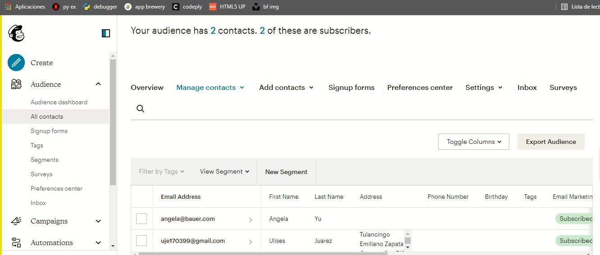
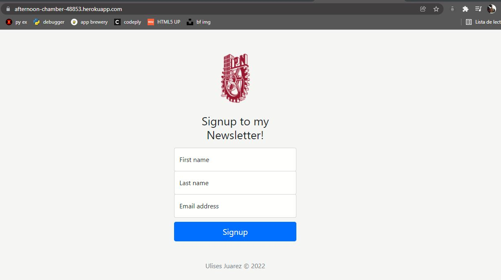
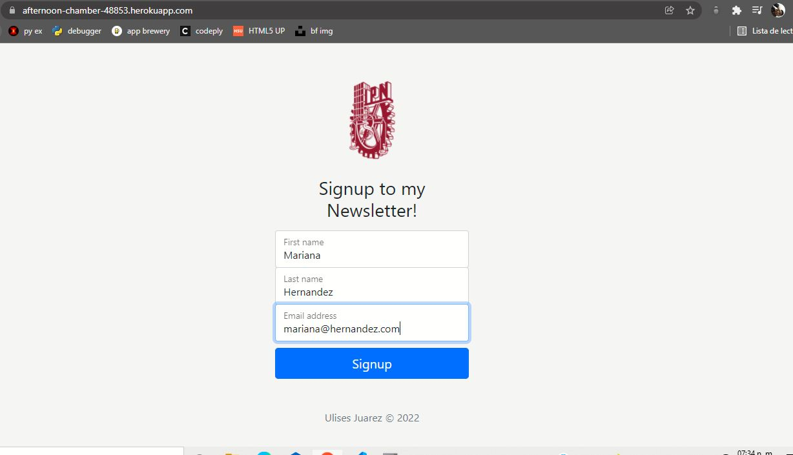
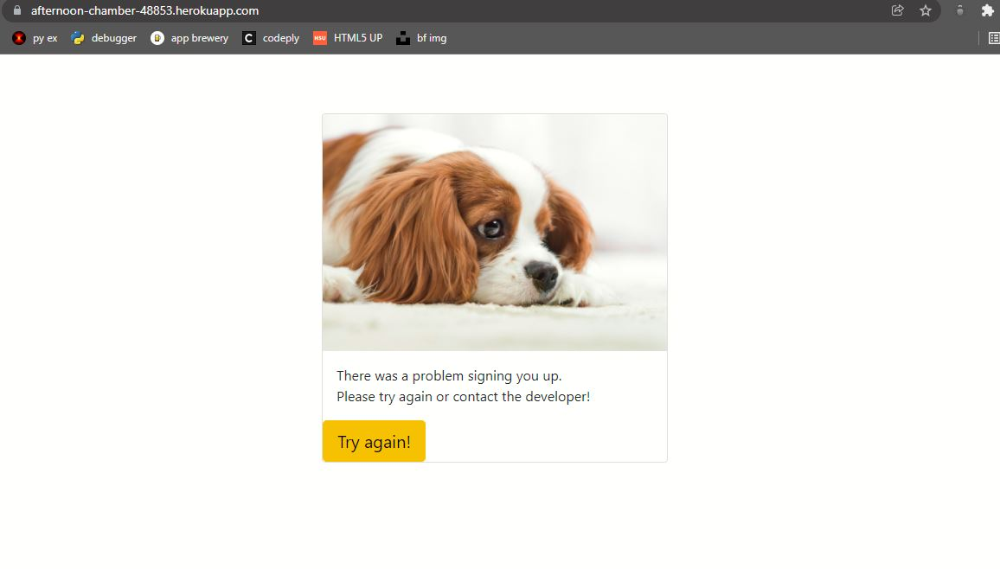
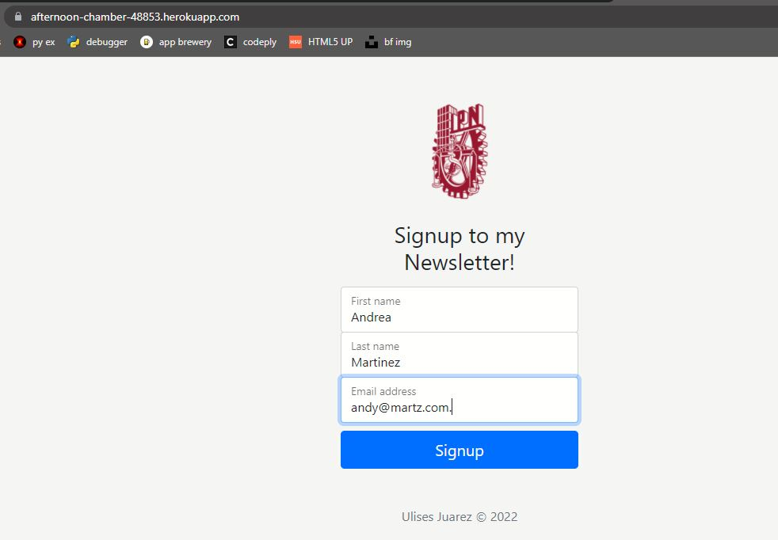
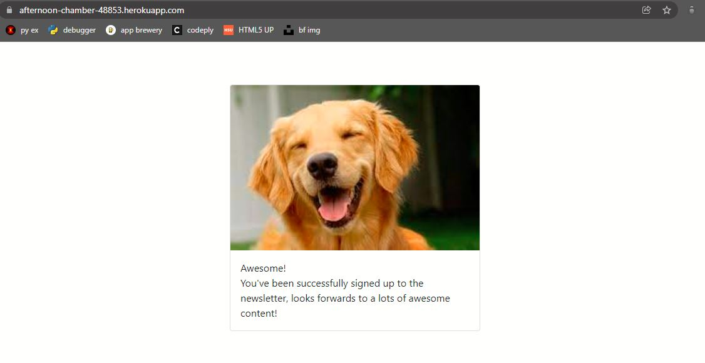
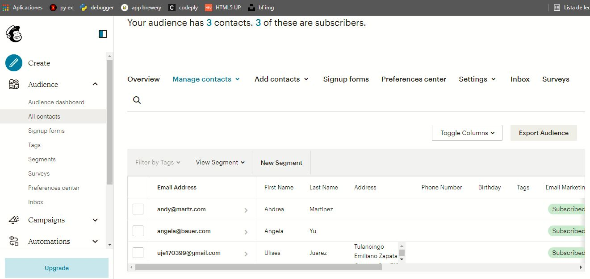

# Mailchimp-API-and-Heroku

Creando una app para que las personas se  subscriban a un boletín de información. 
Puedes venir a subscribirte en el siguiente enlace: https://afternoon-chamber-48853.herokuapp.com/

----

Usando la API "Mailchimp" se muestran los subscriptores que tenemos actualmente.

Ahora accedemos a nuestra aplicación en linea. 

Llenamos el formulario si nos queremos subscribir 

Sí ocurre un error nos aparecera el siguiente mensaje.

Volvemos a llenar los ahora con un nuevo subscriptor. 

Sí el registro es correcto aparecerá el siguiente mensaje.

Finalmente puedo ver las personas que se subscriben desde el panel control de mi API

